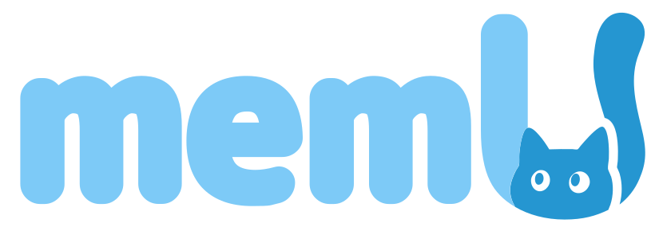

# Open Personal Agent

<p align="center">
  
</p>

<p align="center">
  Open Personal Agent：The Open-Source Framework for Personal Agents
</p>

<p align="center">
  <a href="#features">Features</a> •
  <a href="#quick-start">Quick Start</a> •
  <a href="#installation">Installation</a> •
  <a href="#configuration">Configuration</a> •
  <a href="#development">Development</a> •
  <a href="#contributing">Contributing</a>
</p>

Open Personal Agent is an open-source framework that lets you **create personal mini-apps (agents)** by simply describing your needs. LLMs do the work behind the scenes, and your apps can **remember past interactions**.

Traditional apps and plugins are built for generic use cases, but real-world needs are highly diverse. Building one app per need is impractical.
With Open Personal Agent, you simply describe what you want → get a custom agent generated automatically →**use, improve, and share it**.

## Advantages 📈

- 🎯 **Full Customization** — Not a fixed app. Say your need, and the system generates a mini-app/agent tailored to you.
- ♾️ **Endless Possibilities** — From tools and assistants to entertainment or automation, create as many agents as you need.
- 🤖 **LLM-Driven** — Powered by large models that understand requirements, generate logic, and run your agents.
- 🔓 **Open & Extensible** — Fork, read, modify, deploy, or extend with your own features and plugins.
- 🧠 **Memory Support** — Agents can recall user context and provide not only utility but also ongoing personal companionship.


https://github.com/user-attachments/assets/c175c18f-63ed-45d9-bb09-cc1bca1e1305


## Star Us on GitHub ⭐
Star Open Personal Agent to get notified about new releases and join our growing community of developers creating custom AI-powered mini-apps.

## Quick Start 🚀

### Prerequisites

- Node.js (v18 or higher)
- npm or yarn
- Anthropic API key
- Claude Code (for local code tasks) - see [Claude Code Quickstart](https://docs.claude.com/en/docs/claude-code/quickstart)
- Memory API key - visit [memu.so to get an API key](https://app.memu.so/api-key)

### 1. Clone the repository

```bash
git clone https://github.com/yourusername/open-personal-agent.git
cd open-personal-agent
```

### 2. Install dependencies

```bash
# Install frontend dependencies
cd app
npm install

# Install backend dependencies
cd ../backend
npm install
```

### 3. Set up environment variables

Create a `.env` file in the `backend` directory:

```env
PORT=5174
ANTHROPIC_API_KEY=your_anthropic_api_key_here
```

### 4. Start the application

```bash
# Start backend (in backend directory)
npm run dev

# Start frontend (in app directory, in a new terminal)
npm run dev
```

### 5. Open your browser

Navigate to `http://localhost:5173` (frontend) to start using Open Personal Agent.


## Key Features 💪
- 🤖 **AI Chat Interface**: Seamless chat experience powered by Anthropic Claude
- 🛠️ **Code Generation**: Integrated Claude Code for automated development tasks
- 📱 **Responsive Design**: Beautiful, modern UI that works on desktop and mobile
- 💾 **Session Management**: Persistent chat sessions with history
- 🔌 **WebSocket Support**: Real-time communication between frontend and backend
- 📁 **Application Management**: Create and manage AI-generated applications
- 🎨 **Modern UI**: Built with React, TypeScript, and Tailwind CSS

## Use Cases⛰️
- ⏰ Productivity Tools: e.g. auto-organize emails, filter noise, set reminders
- ✍️ Content Creation Assistant: draft outlines, edit text, generate summaries
- ⚡ Automation Scripts: extract website content, generate reports, send messages
- 📚 Learning Companion: organize notes, generate quizzes, simulate exams, practice languages
- 🎮 Fun & Extensions: chatbots, file organizers, art generation, music recommendations
  
## Contributing

We build trust through open-source collaboration. Your creative contributions drive Open Personal Agent's innovation forward. Explore our GitHub issues and projects to get started and make your mark on the future of Open Personal Agent.


## 🌍 Community
For more information please contact info@nevamind.ai
- GitHub Issues: Report bugs, request features, and track development. [Submit an issue](https://github.com/yourusername/open-personal-agent/issues)
- Discord: Get real-time support, chat with the community, and stay updated. [Join us](https://discord.com/invite/memu)
- X (Twitter): Follow for updates, AI insights, and key announcements. [Follow us](https://x.com/memU_ai)
- WeChat：Access the latest information and participate in community discussions.


### Development Workflow

1. Fork the repository
2. Create a feature branch: `git checkout -b feature/my-feature`
3. Make your changes
4. Run tests: `npm test`
5. Commit your changes: `git commit -am 'Add some feature'`
6. Push to the branch: `git push origin feature/my-feature`
7. Submit a pull request

### Code Style

- Use TypeScript for type safety
- Follow existing code formatting
- Run `npm run lint` to check code style
- Ensure all tests pass


## Acknowledgments

- [Anthropic](https://www.anthropic.com/) for the Claude API
- [Vite](https://vitejs.dev/) for the excellent build tool
- [React](https://reactjs.org/) for the UI framework
- [Tailwind CSS](https://tailwindcss.com/) for styling utilities

---

<p align="center">
  Made with ❤️ by the Open Personal Agent team
</p>
